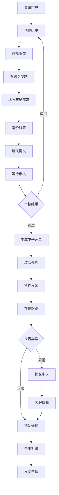

## 1. 产品概述

铁路货运客户服务 Web 门户，面向企业客户提供一站式铁路货运发运、跟踪与结算服务，涵盖运单创建、货物跟踪、费用试算、装卸预约、异常协商及账户管理等核心业务场景。
- 解决企业客户在铁路货运流程中信息分散、操作繁琐的痛点，实现发运-跟踪-结算全链路数字化
- 目标用户为有铁路货运需求的企业客户（制造、物流、商贸等），提升货运效率与透明度

## 2. 核心功能

### 2.1 用户角色

| 角色 | 注册方式 | 核心权限 |
|------|----------|----------|
| 企业客户 | 企业资质审核注册 | 运单创建、货物跟踪、费用管理、装卸预约、异常申诉 |
| 客服人员 | 内部系统分配 | 异常协商处理、客户会话 |

### 2.2 功能模块

1. **首页**：数据概览、快捷入口、通知公告、近期运单
2. **运单创建**：货类选择、到发站查询、车辆需求填写、运价试算、提报审核、电子运单
3. **货物跟踪**：在途节点追踪、到站通知、滞留预警
4. **费用试算**：运价计算、费用明细、电子对账、发票申请
5. **装卸预约**：装车预约、仓位提示
6. **异常协商**：破损短少申诉、客服会话
7. **账户中心**：常用收发货人维护、提报审核状态

### 2.3 页面详情

| 页面名称 | 模块名称 | 功能描述 |
|----------|----------|----------|
| 首页 | 数据概览卡片 | 展示本月发运量、在途运单数、待结算金额、异常待处理数等关键指标 |
| 首页 | 快捷入口面板 | 提供创建运单、货物跟踪、费用试算、装卸预约等常用功能快捷入口 |
| 首页 | 通知公告栏 | 展示系统公告、运价调整、线路变更等重要通知 |
| 首页 | 近期运单列表 | 展示最近5条运单及其状态 |
| 运单创建 | 货类选择 | 支持按品类（煤炭、矿石、钢铁、粮食、化工等）选择货类 |
| 运单创建 | 到发站查询 | 支持按站名、站码搜索发站和到站 |
| 运单创建 | 车辆需求填写 | 填写车型（敞车、棚车、罐车等）、车数、载重等需求 |
| 运单创建 | 运价试算 | 根据货类、到发站、车辆信息实时试算运费 |
| 运单创建 | 提报审核状态 | 展示运单提报后的审核进度（待审核、审核中、已通过、已驳回） |
| 运单创建 | 电子运单 | 审核通过后生成电子运单，支持查看和下载 |
| 货物跟踪 | 在途节点追踪 | 时间轴展示运单各节点（发站、中转站、到站）实时状态 |
| 货物跟踪 | 到站通知 | 货物到站后自动推送通知 |
| 货物跟踪 | 滞留预警 | 货物在站超过规定时长自动预警标识 |
| 费用试算 | 运价计算 | 输入发到站、货类、吨数等参数计算预估运费 |
| 费用试算 | 费用明细 | 展示运费、装卸费、仓储费等各项费用明细 |
| 费用试算 | 电子对账 | 按月/季度生成对账单，支持在线确认 |
| 费用试算 | 发票申请 | 选择已对账费用申请开票，填写开票信息 |
| 装卸预约 | 装车预约 | 选择运单、预约日期时段、指定装卸方式 |
| 装卸预约 | 仓位提示 | 展示目标站点可用仓位信息，辅助预约决策 |
| 异常协商 | 破损短少申诉 | 填写异常类型、上传证据照片、描述问题，提交申诉 |
| 异常协商 | 客服会话 | 与客服人员在线沟通，支持文字和图片消息 |
| 账户中心 | 常用收发货人维护 | 新增、编辑、删除常用发货人和收货人信息 |
| 账户中心 | 提报审核状态 | 汇总展示所有运单提报的审核状态及详情 |

## 3. 核心流程

**运单创建与发运流程**：企业客户登录门户 → 选择货类 → 查询到发站 → 填写车辆需求 → 运价试算 → 确认提交 → 等待审核 → 审核通过生成电子运单 → 装卸预约 → 货物发运

**货物跟踪流程**：选择运单 → 查看在途节点 → 接收到站通知 → 处理滞留预警（如有）

**费用结算流程**：查看费用明细 → 电子对账确认 → 申请发票

**异常处理流程**：发现破损/短少 → 提交申诉 → 客服协商 → 达成处理方案

## 4. 用户界面设计

### 4.1 设计风格

- 主色调：深铁蓝 (#1B3A5C)，辅以暖铜色 (#C87533) 作为强调色，呼应铁路工业质感
- 次要色：石板灰 (#4A5568)、淡钢蓝 (#E8EEF4)、警示橙 (#E67E22)
- 按钮风格：圆角 6px，主按钮为实心铁蓝色，次按钮为描边样式
- 字体：标题使用 Noto Serif SC（衬线），正文使用 Noto Sans SC（无衬线）
- 布局风格：左侧固定导航栏 + 右侧内容区，卡片式布局
- 图标风格：线性图标（Lucide），统一 20px 大小

### 4.2 页面设计概览

| 页面名称 | 模块名称 | UI 元素 |
|----------|----------|----------|
| 首页 | 数据概览卡片 | 4列网格卡片，铁蓝渐变背景，白色文字，悬停微动效 |
| 首页 | 快捷入口面板 | 2x2 网格图标按钮，铜色图标 + 灰色文字标签 |
| 首页 | 通知公告栏 | 垂直列表，左侧色条标识类型，悬停展开详情 |
| 首页 | 近期运单列表 | 表格样式，状态标签色块，点击跳转详情 |
| 运单创建 | 货类选择 | 横向滚动卡片，选中态铜色边框 + 勾选图标 |
| 运单创建 | 到发站查询 | 搜索下拉组合框，输入时实时匹配站名列表 |
| 运单创建 | 车辆需求填写 | 表单输入组，车型下拉、车数/载重数字输入 |
| 运单创建 | 运价试算 | 右侧浮动计算面板，费用项分行展示，总额加粗 |
| 运单创建 | 提报审核状态 | 步骤条组件，4步流程指示 |
| 运单创建 | 电子运单 | 运单详情卡片，右上角下载按钮 |
| 货物跟踪 | 在途节点追踪 | 垂直时间轴，节点圆点 + 状态标签 + 时间信息 |
| 货物跟踪 | 到站通知 | 顶部通知横幅，绿色图标 + 文字描述 |
| 货物跟踪 | 滞留预警 | 红色预警标签 + 预警详情弹窗 |
| 费用试算 | 运价计算 | 左侧参数表单 + 右侧计算结果卡片 |
| 费用试算 | 费用明细 | 分组表格，运费/装卸费/仓储费各一组 |
| 费用试算 | 电子对账 | 对账单列表 + 详情展开面板 |
| 费用试算 | 发票申请 | 申请表单 + 历史申请记录表 |
| 装卸预约 | 装车预约 | 日历选择器 + 时段选择 + 运单关联下拉 |
| 装卸预约 | 仓位提示 | 仓位可用性热力图/进度条，绿/黄/红色标识 |
| 异常协商 | 破损短少申诉 | 申诉表单（类型选择+文本域+图片上传）+ 申诉记录列表 |
| 异常协商 | 客服会话 | 左侧会话列表 + 右侧聊天面板，消息气泡样式 |
| 账户中心 | 常用收发货人维护 | 卡片列表 + 新增/编辑弹窗表单 |
| 账户中心 | 提报审核状态 | 表格列表，状态标签 + 展开查看审核详情 |

### 4.3 响应式设计

- 桌面优先设计，最小宽度 1280px
- 内容区最大宽度 1440px，居中布局
- 侧边导航在 1024px 以下折叠为图标模式
- 表格组件在窄屏下支持横向滚动

### 4.4 3D 场景指引

不适用
