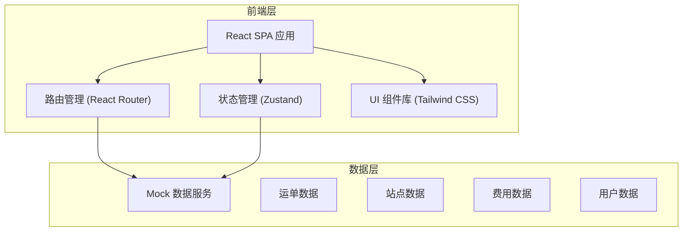
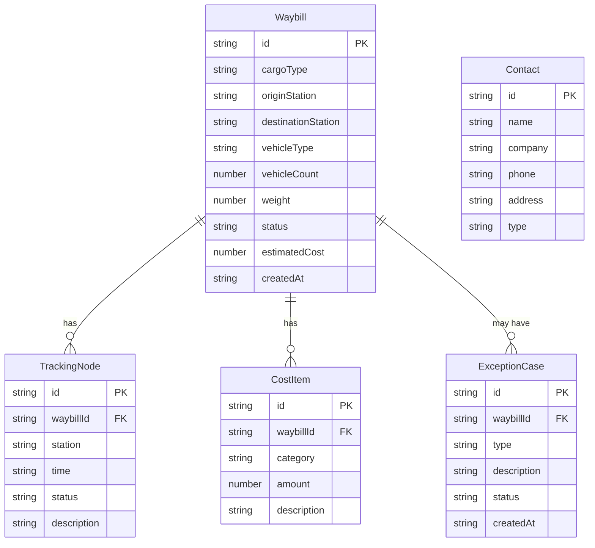

## 1. 架构设计



## 2. 技术说明

- 前端：React@18 + TypeScript + Tailwind CSS@3 + Vite
- 初始化工具：vite-init
- 后端：无（纯前端，使用 Mock 数据）
- 状态管理：Zustand
- 路由：React Router DOM v6
- 图标：Lucide React

## 3. 路由定义

| 路由 | 用途 |
|------|------|
| / | 首页 - 数据概览、快捷入口、通知公告 |
| /waybill/create | 运单创建 - 货类选择、到发站、车辆需求、运价试算 |
| /tracking | 货物跟踪 - 在途节点追踪、到站通知、滞留预警 |
| /cost | 费用试算 - 运价计算、费用明细、电子对账、发票申请 |
| /loading | 装卸预约 - 装车预约、仓位提示 |
| /exception | 异常协商 - 破损短少申诉、客服会话 |
| /account | 账户中心 - 常用收发货人维护、提报审核状态 |

## 4. API 定义

本项目为纯前端应用，使用 Mock 数据模拟后端接口。关键数据类型定义如下：

```typescript
interface Waybill {
  id: string
  cargoType: string
  originStation: string
  destinationStation: string
  vehicleType: string
  vehicleCount: number
  weight: number
  status: 'draft' | 'pending' | 'approved' | 'rejected' | 'in_transit' | 'arrived'
  estimatedCost: number
  createdAt: string
}

interface TrackingNode {
  station: string
  time: string
  status: 'passed' | 'current' | 'upcoming'
  description: string
}

interface CostItem {
  category: string
  amount: number
  description: string
}

interface Contact {
  id: string
  name: string
  company: string
  phone: string
  address: string
  type: 'shipper' | 'consignee'
}

interface ExceptionCase {
  id: string
  waybillId: string
  type: 'damage' | 'shortage' | 'other'
  description: string
  status: 'submitted' | 'processing' | 'resolved'
  images: string[]
  createdAt: string
}
```

## 5. 服务端架构图

不适用（纯前端项目）

## 6. 数据模型

### 6.1 数据模型定义



### 6.2 数据定义语言

不适用（纯前端 Mock 数据，无数据库）
